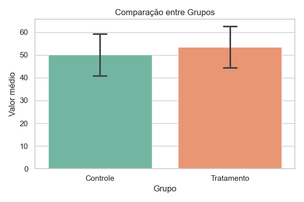

# 📊 Gerador de Relatórios Estatísticos em PDF e HTML

Este é um gerador automatizado de relatórios estatísticos a partir de arquivos CSV com dois grupos experimentais. Ele realiza análise descritiva, teste t de Student, gera gráficos comparativos e cria um relatório completo em **PDF** e **HTML** com layout profissional.

⚠️ Esta é uma versão beta. Use por sua conta e risco. **Feedbacks são bem-vindos!**

---

## 🧪 Para que serve?

Ideal para:

* Pesquisadores em ciências biológicas, sociais e saúde
* Estudantes de pós-graduação
* Técnicos de laboratório que precisam de relatórios rápidos
* Qualquer pessoa que lide com dados de comparação entre dois grupos

---

## 🚀 Funcionalidades

* 📁 Leitura de arquivos CSV com colunas: `Grupo` e `Valor`
* 📊 Geração automática de gráficos de barras com erro padrão
* 📈 Cálculo de média, desvio padrão e tamanho amostral (`n`)
* 🧪 Teste t de Student para amostras independentes
* 📄 Renderização em HTML usando Jinja2
* 📌 Exportação final em PDF com visual limpo
* ✅ Suporte a nomes de grupos personalizados (não precisa ser "Controle" ou "Tratamento")

---

## 📷 Exemplo



---

## 📂 Estrutura do Projeto

```
seu_projeto/
│
├── data/
│   └── exemplo_dados.csv         # Seus dados de entrada
│
├── images/
│   └── grafico.png               # Gráfico gerado automaticamente
│
├── output/
│   ├── relatorio.html            # Relatório HTML
│   └── relatorio_final.pdf       # Relatório PDF
│
├── templates/
│   └── relatorio.html            # Template HTML Jinja2
│
├── main.py                       # Script principal
└── README.md                     # Este arquivo
```

---

## ⚙️ Como usar

### Pré-requisitos

* Python 3.8+
* Instale as bibliotecas necessárias:

```bash
pip install pandas matplotlib seaborn scipy jinja2 weasyprint
```

### Rodando o script

1. Coloque seu arquivo `.csv` em `data/`.
2. Certifique-se de que ele tenha duas colunas: `Grupo` e `Valor`.
3. Execute:

```bash
python main.py
```

4. Verifique os arquivos em `output/`.

---

## 📀 Exemplo de CSV

```csv
Grupo,Valor
Tratamento,4.5
Tratamento,5.2
Tratamento,5.0
Controle,3.8
Controle,4.1
Controle,3.9
```

---

## 📌 Planejado para o futuro

* Interface gráfica (GUI)
* Comparação de mais de dois grupos
* Seleção de testes estatísticos diferentes
* Geração de gráficos de dispersão, boxplot, etc.

---

## 🤝 Contribuições

Sinta-se livre para abrir *issues*, *pull requests*, ou sugerir melhorias.

---

## 📢 Contato

Se tiver dúvidas ou sugestões, entre em contato via \[[gimenezenrico@yahoo.com.br](mailto:gimenezenrico@yahoo.com.br)] ou crie uma *issue* aqui no GitHub.

---

## 🧠 Licença

Este software é proprietário e não está licenciado para redistribuição ou modificação. Para uso comercial ou acadêmico, entre em contato com o autor.
